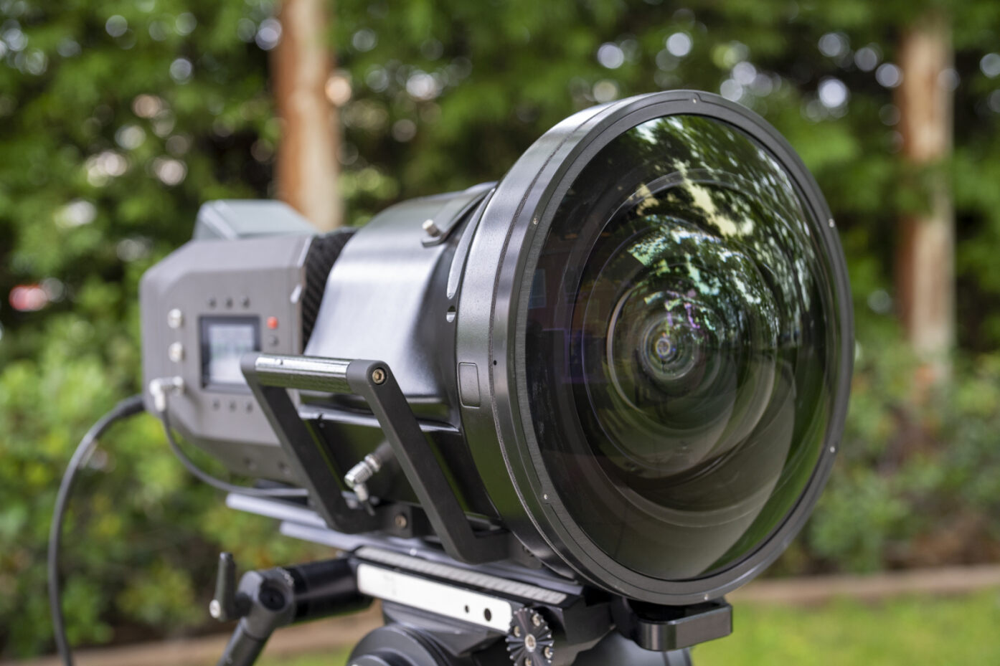
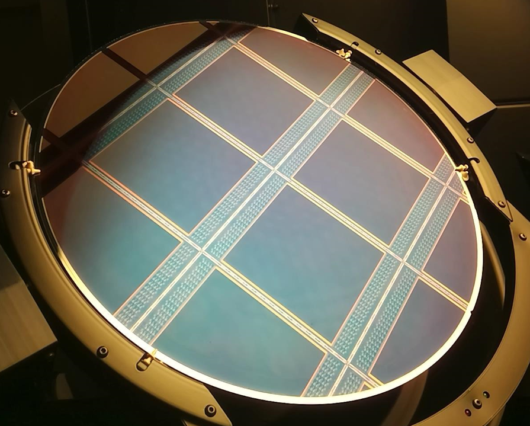

==================
The Big Sky Camera
==================

The Big Sky camera is special purpose camera developed to shoot video for display inside the Sphere theatre in Las Vegas. 

	Big Sky Camera with its wide angle lens attached. Image from press-kit (`source <https://msgco.sharepoint.com/sites/MSGEPRA/Documents/Forms/AllItems.aspx?ga=1&id=%2Fsites%2FMSGEPRA%2FDocuments%2FSPHERE%2FPress%20Kit%20%2D%20Sphere%20Studios%20and%20STMicroelectronics&viewid=d7e0b399%2D3ff3%2D435b%2Da4b6%2D4382a7039e1f>`_)

The sensor is designed by Forza Silicon and manufactured by STMicroelectronics in their fab in Crolles, France [#]_. 

.. figure directive only works once per page for some reason?

*Photo of a 300mm wafer with the Big Sky sensors patterned. Each sensor  measures 8.31cm by 9.92cm* (`source <https://newsroom.st.com/media-center/press-item.html/t4598.html?ecmp=tt36884_gl_social_jan2024>`_)

All images are from the press-kit (`source <https://msgco.sharepoint.com/sites/MSGEPRA/Documents/Forms/AllItems.aspx?ga=1&id=%2Fsites%2FMSGEPRA%2FDocuments%2FSPHERE%2FPress%20Kit%20%2D%20Sphere%20Studios%20and%20STMicroelectronics&viewid=d7e0b399%2D3ff3%2D435b%2Da4b6%2D4382a7039e1f>`_)

Specs
-----
.. list-table:: Performance Summary
  :widths: 30 50

  * - Parameter
    - Value
  * - Pixel pitch
    - 4.3 :math:`\mu m`
  * - Array size
    - 18400 x 17712
  * - Dynamic range
    - 87dB
  * - Linear full well
    - High gain: 6600 :math:`e^-` , Low gain: 41,000 :math:`e^-`
  * - Conversion gain
    - High gain: 150 :math:`\mu V / e^-`, Low gain: 19.1 :math:`\mu V / e^-`
  * - Total temporal noise
    - High gain: 1.8 :math:`e^-` , Low gain: 13 :math:`e^-`
  * - Dark current
    - 55 :math:`\text{e^-}` (At 70°C)

Video
-----
.. youtube:: fSUlbcpZJmA
  :width: 100%

Publications
------------
International Image Sensor Workshop (IISW) paper: `A 316MP, 120FPS, High Dynamic Range CMOS Image Sensor for Next Generation Immersive Displays <https://imagesensors.org/Past%20Workshops/2023%20Workshop/2023%20Papers/R73.pdf>`_

MDPI Paper: `A 316MP, 120FPS, High Dynamic Range CMOS Image Sensor for Next Generation Immersive Displays <https://www.mdpi.com/1424-8220/23/20/8383>`_

.. [#] https://newsroom.st.com/media-center/press-item.html/t4598.html?ecmp=tt36884_gl_social_jan2024
